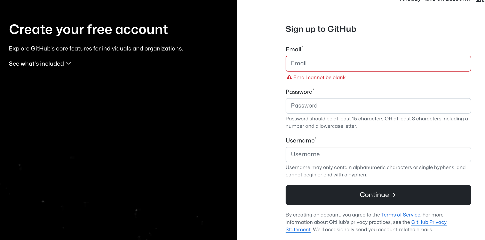

# Using Git in VS Code and Github

You can follow [https://code.visualstudio.com/docs/sourcecontrol/intro-to-git](https://code.visualstudio.com/docs/sourcecontrol/intro-to-git)

Git cheatsheet: [https://github.com/arslanbilal/git-cheat-sheet](https://github.com/arslanbilal/git-cheat-sheet)

Online version [here](https://www.notion.so/Using-Git-in-VS-Code-and-Github-19f44b73854b809fa008c4b593054741?pvs=21)

### Install Git

Go to [https://git-scm.com/downloads](https://git-scm.com/downloads)

- For MacOS
    
    open the “Terminal” app, copy-paste and run
    
    ```bash
    /bin/bash -c "$(curl -fsSL https://raw.githubusercontent.com/Homebrew/install/HEAD/install.sh)"
    ```
    
    Then run `brew install git` (you may need to close the terminal and open again)
    
    To verify if you have git installed, run in the terminal `git --version` 
    
- For Windows click on “Windows” and choose “64-bit Git for Windows Setup”
    
    Just use the default settings and click Next towards the end.

After installing git, run these in your Terminal (choose your own name and email, and you can use fake email and names for privacy)

```bash
git config --global user.name "My Name"
git config --global user.email "my_name@example.com"
```

### Register Github Account

Go to [https://github.com/signup](https://github.com/signup), and register with your personal email.

The reason to use a personal email is that it may stay with you longer, and you can add [education verification](https://github.com/education) later with EPFL email to use [Copilot](https://github.com/features/copilot) for free.



### Login to Github on VS Code

Click on the Avatar button and Sign in (a browser page will pop up and guide you through)


### Configuring SSH (optional)

Nowadays if you login to Github and use VS Code interface, this part is usually not necessary. But you may want to use the command line someday.

- What is SSH https://docs.github.com/en/authentication/connecting-to-github-with-ssh/about-ssh
    
    Simply speaking it is a way to safely transfer data. The sender will use the public key to encrypt the message, and only the person with the corresponding private key will be able to decode the message. You can add public key to your Github account, then when you try to push a commit to the repository, Github will use the trusted public key to verify if the push comes from a computer with the corresponding private key (which is your computer).
    
To start with, generate your SSH keys (you can follow [Github doc](https://docs.github.com/en/authentication/connecting-to-github-with-ssh/generating-a-new-ssh-key-and-adding-it-to-the-ssh-agent#generating-a-new-ssh-key))
```bash
ssh-keygen -t ed25519 -C "your_email@example.com"
```

Open a new terminal and run `cat ~/.ssh/id_ed25519.pub`.
For windows users, run `type C:\Users\YOUR_USERNAME\.ssh\id_ed25519.pub`. Note that if you run windows CMD from start menu without Administrator mode, you can see the terminal is opened at `C:\Users\YOUR_USERNAME`. 

Copy everything printed (it should be a long starting with `ssh-ed25519` and ending with your email). 

Go to [https://github.com/settings/keys](https://github.com/settings/keys), and click “New SSH Key”, give it a name, paste the copied string, and add. 


### Using Git with VS Code

- A common workflow of Git can be summarized as the following chart, and we will see how to use VS Code to do these.
    
    
    

<aside>
💡

The following example applies to the case where you want to contribute you own contents to an open-source software project. 

</aside>

- First, create a fork of the course repo from Github (needs logging in), and you will have a copied project for your own editing, and it is linked to the original repo at same time.
    
    
    
- Then clone the forked repo from your Github page. You can find the link as shown by the picture above, but use your own fork repo. Open a folder in VS Code and run in terminal
    
    ```bash
    git clone REPLACE_WITH_THE_LINK_OF_YOUR_REPO
    ```
    
- Afterwards, you will see the files in the repository has been downloaded to your folder
    
    
    

---

Now, open the “hello.md” file under the Lab_2 folder and write something to introduce yourself.

- `git add` working directory → stage
    
    You can click on “+” to add the file to “stage”. You can undo this by clicking “-” afterwards.
    
    Adding a file to stage means you think a part of your idea has been completed, but you still need to work on other files in order to complete your contribution.
    
    VS code will highlight the changes for you (`git diff`), and the file is marked as “M” (modified)
    
    
    
    - If the file is newly added, VS Code will mark the file name in green with an “A”
        
        
        
- `git commit` stage → local repository
    
    When the work is completed, you write a summary message and click “Commit”. After committing, the changes will be saved from staging to local repository. 
    
- `git push` local → remote, and `git pull` remote → work directory
    
    After clicking “Commit” you will find it has been replaced by “Sync Changes” (assume you have no other uncommitted changes). Sync will do push and pull for you at the same time.
    
    Alternatively, you can use the push and pull in VS Code source control. You can even undo your last commit if you find things are not right. 
    
    
    
- `git diff` can compare the differences between two branches, but it is easier to use Github.
    
    For example [https://github.com/vita-epfl/civil127-2025/compare/main...develop](https://github.com/vita-epfl/civil127-2025/compare/main...develop)
    
    This URL will compare the `main` branch with the `develop` branch, and the comparison is based on the `main` branch, you can see the differences if there are any.
    

---

You can click “Sync Changes” now to upload your local contents to your fork Github repo. 

Then, open the webpage of your fork repo, you will find a button to “Contribute” to the original course repo. 


Click “open pull request”, write something to summarize what you have done and why you want to do this, so the managers of the course repo can better understand your contribution.